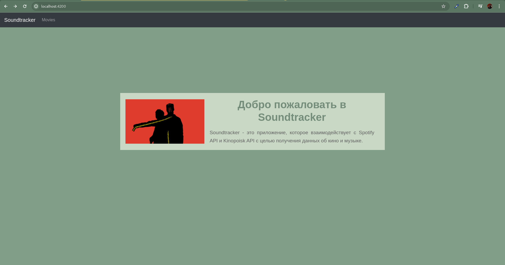
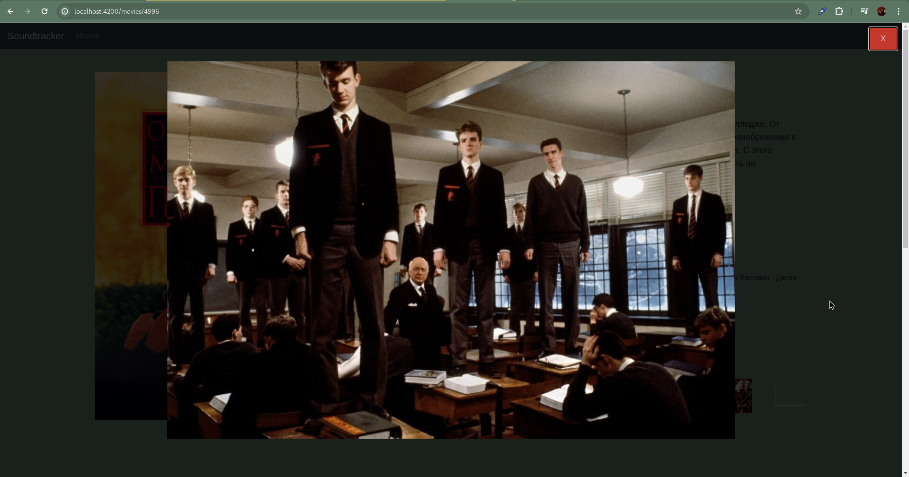

# Soundtracker (fullstack application)

The purpose of the project is to create a fullstack web application. Subject area -  music and films. 
**[Spotify API](https://developer.spotify.com/)** 
**[Kinopoisk API](https://kinopoisk.dev/)** 

| Stage                                | Description                                                                                                        | Expected (hours) | Actual (hours) |
|--------------------------------------|--------------------------------------------------------------------------------------------------------------------|------------------|----------------|
| Database                             | Design a database schema according to the project theme. Minimum 7 tables, many to many relationship is mandatory. | 6                | 6              |
| JDBC                                 | Create a console application to perform CRUD operations using JDBC.                                                | 7                | 7              |
| JSP                                  | Developing the client side using JSP.                                                                              | 20               | 17             |
| Backend using SpringBoot + Hibernate | Creating an application backend using SpringBoot and Hibernate.                                                    | 35               | 35             |
| Angular - Frontend                   | Frontend development using Angular.                                                                                | 20               | 15             |
| React - Frontend                     | Frontend development using React.                                                                                  | 15               | Y              |

## Task 1. Database architecture design

### Results: [DDL](Database/version_03_03_2024.txt)

---

## Task 2. JDBC console application

### Results: [CODE](JDBC)

---

## Task 3. Java EE. Client side using JSP (Java Server Pages)

### Results: [CODE](JSP)

### `localhost:8080/api/`

### `localhost:8080/api/movies.jsp`

### `http://localhost:8080/api/movie.jsp?id=725190`

---

## Task 4. Backend using SpringBoot + Hibernate

### Results: [CODE](backend)

## Main features:
1. [x] Interaction with Spotify API and Kinopoisk API
2. [x] Authentication and authorization using JWT
3. [x] CRUD operations 
4. [x] Many to many relationship
5. [x] Pagination

## API Endpoints:
1. `/api/auth/sign-up` - sign up
2. `/api/auth/sign-in` - sign in
3. `/api-soundtracker/movie/info?id={id}` - get movie info by id
4. `/api-soundtracker/movie/set-album?id={id}` - set album to movie
5. `/api-soundtracker/movie/update?id={id}` - update movie info from Kinopoisk API
6. `/api-soundtracker/music/info?name={name}` - get album info by name
7. `/api-soundtracker/api-movie/info-by-title?title={title}` - get movie info by title from Kinopoisk API
8. `/api-soundtracker/api-movie/info?id={id}` - get movie info by id from Kinopoisk API
9. `/api-soundtracker/api-music/album?name={name}` - get album info by name from Spotify API
10. `/api-soundtracker/db-movie/update?id={id}` - update movie info from database
11. `/api-soundtracker/db-movie/save` - save movie to database
12. `/api-soundtracker/db-movie/delete?id={id}` - delete movie from database
13. `/api-soundtracker/db-movie/info?id={id}` - get movie info by id from database
14. `/api-soundtracker/db-movie/all-movies` - get all movies from database
15. `/api-soundtracker/db-movie/all-movies-dto` - get all movies from database with DTO
16. `/api-soundtracker/db-music/update?id={id}` - update album info from database
17. `/api-soundtracker/db-music/save` - save album to database
18. `/api-soundtracker/db-music/delete?id={id}` - delete album from database
19. `/api-soundtracker/db-music/album-by-name?name={name}` - get album info by name from database
20. `/api-soundtracker/db-music/album-by-id?id={id}` - get album info by id from database
 

---

## Task 5. Frontend using Angular

### Results: [CODE](angular-client)

---

## Task 6. Frontend using React

### Results: [CODE](react-client)
